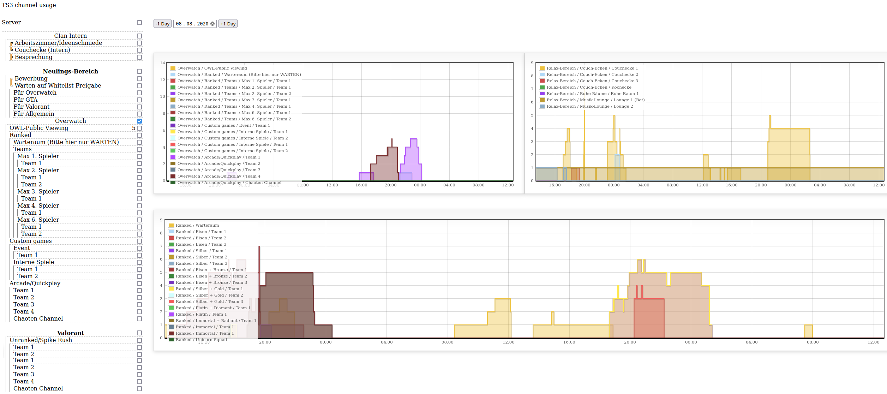

# Sinusbot Channel Statistics

## Log number of clients per channel to mysql

With the help of the sinusbot script `channel-statistics.js` the number of connected clients for each channel will be logged to a mysql database.

## PHP graphical frontend

A php viewer script is located in `ts3-viewer/`. It is an interactive flot graph implementation combined with a channel navigator.

# Installation

## Backend
tested on: *mysql-server8, sinusbot scripting v8*
1. Create a MySQL database and import the [table definitions](createTables.sql).
2. Copy the [channel statistics plugin](channel-statistics.js) to your sinusbot scripts folder.
3. Restart the sinusbot client and enable the plugin.
4. Configure the MySQL connection in the admin panel of sinusbot.

## Frontend
tested on: *mysql-server8, apache2, php7.4*
1. Copy the `ts3-viewer/` folder into your php webroot.
2. Insert your database credentials into `connection.php`.
3. Done!